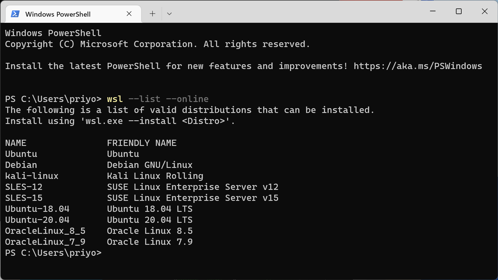
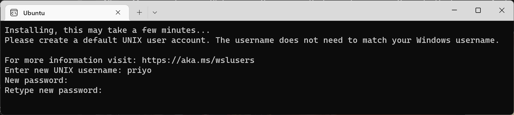
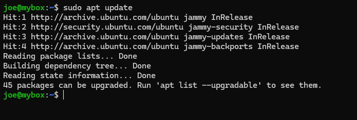
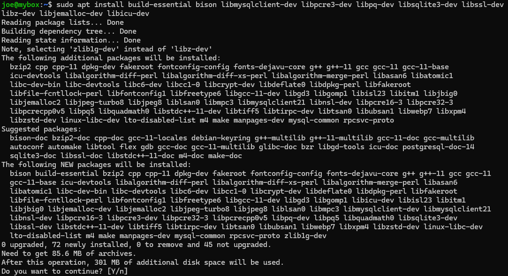
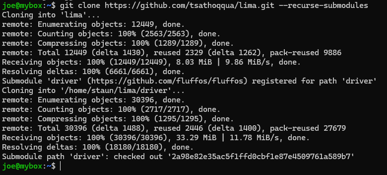
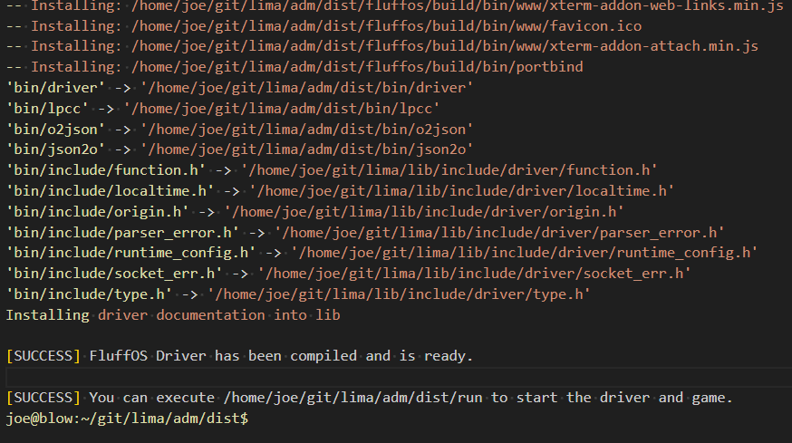

************
Installation
************

This is meant to be a rudimentary guide for getting you started with LIMA. Instead of building it directly on Windows, 
we recommend using Windows Subsystem for Linux or a virtual machine if you do not have a Linux Server available. These come
cheap from most Linux hosting companies.

Requirements: 1 Gb of memory and 1 Gb of disk should be plenty.

See https://www.fluffos.info/build.html for more options for building FluffOS.

Windows Subsystem for Linux (WSL)
---------------------------------

1. Open a Powershell or command prompt on Windows and do ``wsl --list --online`` to see which distributions are available for your Windows system.

2. Install Windows Subsystem for Linux - we recommmend Ubuntu, but up to you:

    ``wsl --install -D Ubuntu``

3. Set a username and a password for your Linux:

4. Update apt, and install packages needed for compiling FluffOS

    |   ``sudo apt update``

Then install prerequisites for Ubuntu:

    |   ``sudo apt install build-essential bison libmysqlclient-dev libpcre3-dev libpq-dev libsqlite3-dev libssl-dev libz-dev libjemalloc-dev libicu-dev cmake git``

or for Debian:

    |   ``sudo apt install build-essential bison libmariadb-dev libmariadb-dev-compat libpcre3-dev libpq-dev libsqlite3-dev libssl-dev zlib1g-dev libjemalloc-dev libicu-dev cmake git``

(These packages are prone to change, so modify as needed - I cannot keep chasing changes in versions and package names here)

    |   ``sudo apt install build-essential bison libmysqlclient-dev libpcre3-dev libpq-dev libsqlite3-dev libssl-dev libz-dev libjemalloc-dev libicu-dev cmake``

5. Clone LIMA sources from github. It's available from two sources:

    |   Stable: https://github.com/fluffos/lima
    |   Development: https://github.com/tsathoqqua/lima
    |
    |   ``git clone https://github.com/tsathoqqua/lima.git --recurse-submodules``

6. Use --recurse-submodules to checkout the fluffos driver submodule. You can decide not to and use another driver if you want. LIMA comes with a build script after checking out the files:

    |    ``cd lima/adm/dist``   
    |    ``./rebuild``

    Lots of output will follow, and the final screen will say something like:

7. If you get complaints about missing dependencies here, try to install them via ``apt install`` or use ``apt search`` to find them.
    |    ``sudo apt install libssl3``
    |    (Just an example)

8. After build has completed, try:

    ``./run``

10. You might see a few warnings, but should be able to telnet to localhost 7878 (or use Mudlet from https://www.mudlet.org/). It is also possible to set up your MUD to use Websockets and then visit http://localhost:7878/ in your favourite browser. This can be reconfigured in the ``config.mud`` in the adm/dist directory of LIMA.

Ubuntu
------

Same as above, except you can skip directly to step 4.

