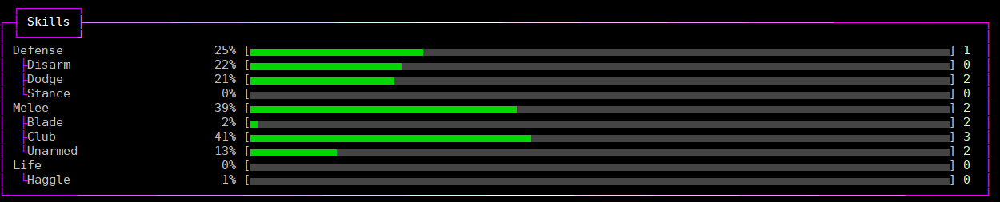
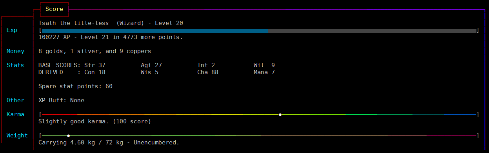
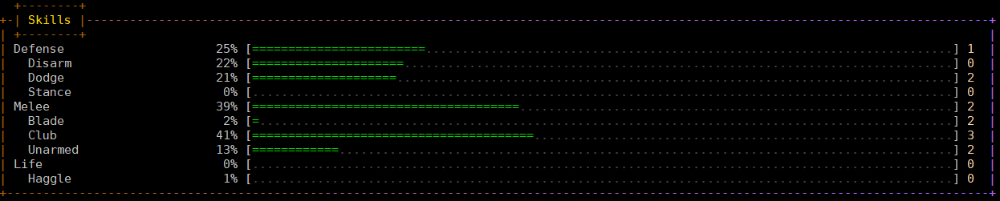
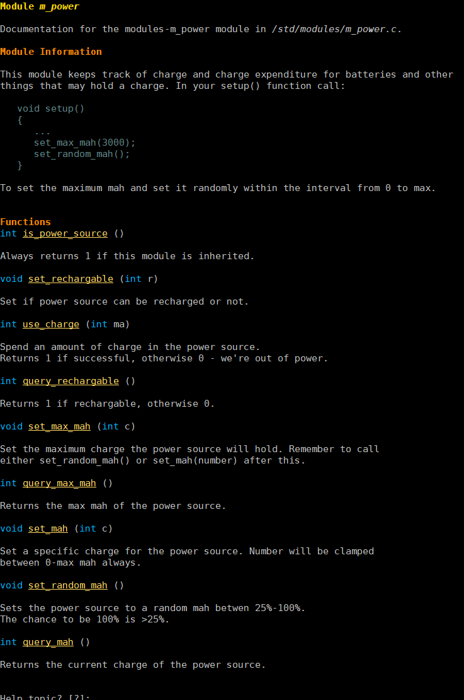
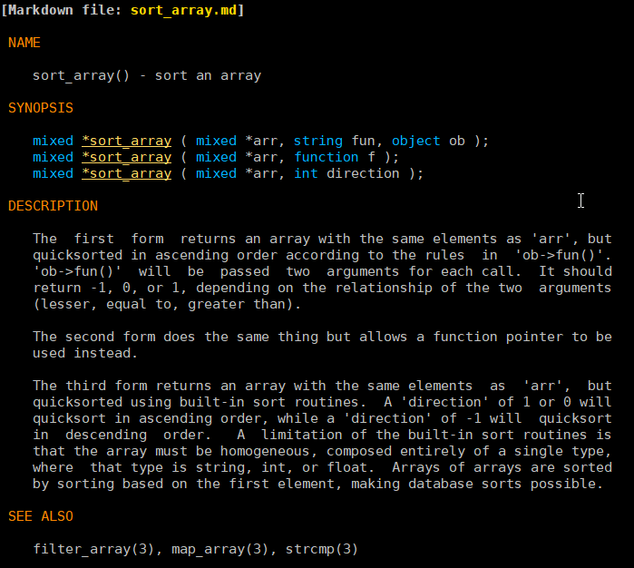
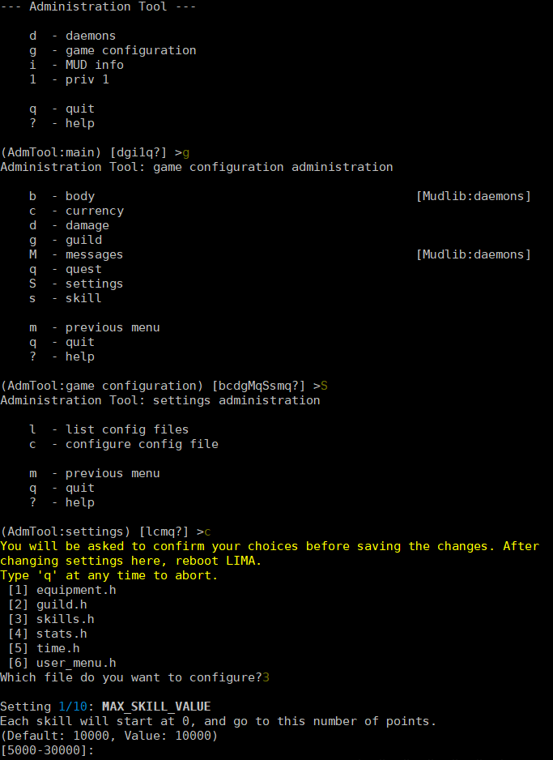
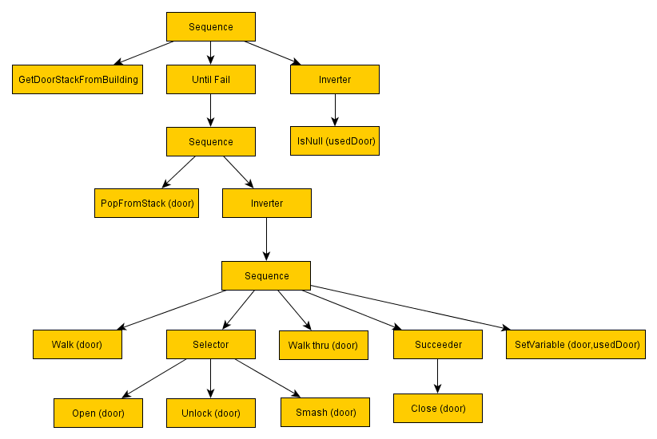
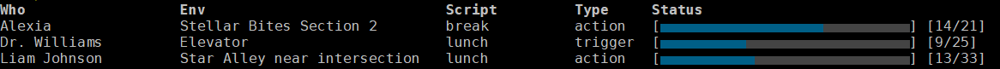

*************
LIMA Showcase
*************

This page shows a few of the newer features of the LIMA mudlib. These are all on top of:

- Centralized natural language parsing (Zork like commands for players).
- Socials use the natural language parsing, and are easy to extend. (The soul is *huge*).
- Wizards have featureful shells including full unix globbing (ls \*.[ch]), command piping / redirection, etc...
- Inline documentation.	
- Distributed support.
- Very modular, with clear code.
- Support for Intermud-3.
- Modal input, and fully featured interactive shells.
- Real, secure security authored by Ellery @ TMI-2 (Reimer Behrends).
- Emphasis on player usability: better news, channels, menus, etc...	than any other mudlib
- Easy to build menus, easy to write socials, etc...
- A menu driven admin tool to ease routine administration tasks.

=====================
Dynamic modern layout
=====================

LIMA supports fancy frames player commands, and include both horizontal and vertical headers. The frames
can be themed in different colours and styles using the :doc:`frames command <../player_command/frames>`, 
either using UTF-8 characters or simple ASCII characters.

  Example of the :doc:`skills <../player_command/skills>` command.

The frames will automatically fit the width of your  screen or whatever you select 
using the :doc:`width <../player_command/width>` player command. 

.. figure:: images/frames3.png
  :width: 700
  :alt: skills command in a smaller format

  Example of the :doc:`skills <../player_command/skills>` command on a narrow screen.

Depending on the command, some commands may adopt their internal layout depending on the 
width of your screen. The frames also support using auto-scaling widgets for illustrating progress, 
balance between good and bad and more.

  Example of the :doc:`score <../player_command/score>` command.

If your MUD client does not support UTF-8, you will automatically receive the ASCII version. Several 
style options can be selected, like 'single', 'lines', 'ascii', 'double', but also 'none' to remove
all frames, e.g. if you are using a screen reader they might not be pleasant on your ears.

  Example of the :doc:`skills <../player_command/skills>` command in ASCII mode.

---------------------
Developer information
---------------------

Each frame defines accent and warning colours that can be used as standard when doing layout. The
frame library will do a lot of the work for you, but you have to check yourself when the width is
so wide/slim that the layout needs to change.

Example of code:

.. code-block:: c

   set_frame_title("Mail Groups");
   set_frame_left_header();
   set_frame_header(header);
   set_frame_content(output);
   out(frame_render());

Useful module documentation to read:

- :doc:`Module: m_frame <module/modules-m_frame>`
- :doc:`Module: m_widgets <module/modules-m_widgets>`

=======================
Marked up documentation
=======================

The auto documentation system in LIMA (which was orignally inspired by JAVA), collects mark-up from source
files, and creates help pages and fills the help system with topics. Two types of files exist:

Markdown, or .md are files typically copied from the driver and are mostly for Wizards.

  Example of a reStructured text file. The viewer highlights searched terms as well.

And reStructured Text, or .rst files are documentation for player commands, wizard commands and more. They 
provide coloured mark up on the MUD, as well as online (here).

  Example of a driver contributed markdown file.

The wizard :doc:`apropos command <command/apropos>` will provide a list of help pages and functions that
match the query, and a following 'man add_start', e.g., will then bring up the entire help page for 
`module m_conversation <module/modules-m_conversation>`.

---------------------
Developer information
---------------------

For more on what you need to do, to continue to use the auto documenation system, see 
the page on the :doc:`AUTODOC system <documentation/Autodocs>`.

=========================
Menu driven configuration
=========================

A lot of options in the mudlib can be configured via config files under */include/config/*. All these files
have a special format that includes instructions for range of values, default values and more.

.. code-block:: c

  // Each skill will start at 0, and go to this number of points.
  // Default: 10000
  // Range: 5000-30000
  // Type: integer
  #define MAX_SKILL_VALUE 10000

All the config files can modify the mudlib in fundamental ways, and can be configure using the 
`admtool command <command/admtool>`.

  
  Example for configuring values via the admtool.

---------------------
Developer information
---------------------

Some settings may impact player .o files, so make sure you get the configuration right before
opening up your MUD, e.g. changing MAX_SKILL_VALUE to 5000 will impact all players that already 
levelled up their skills above 5000, but some changes may break player files. Test your decisions 
carefully.

Your player files are not parsed and change for compatibility issues, we leave that to you.

===============
Behaviour trees
===============

The library contains a simple implementation of 
`behaviour trees <https://outforafight.wordpress.com/2014/07/15/behaviour-behavior-trees-for-ai-dudes-part-1/>`_ 
(this page is relied on for definitions and examples below) for monsters to make decisions. A simple 
set of nodes have been implemented, and can easily be extended:

- Root node: Beginning of the tree.
- Sequence node: A sequence will visit each child in order, starting with the first, and when that succeeds 
  will call the second, and so on down the list of children. If any child fails it will immediately return 
  failure to the parent. If the last child in the sequence succeeds, then the sequence will return success 
  to its parent.
- Selector node: Will return a success if any of its children succeed and not process any further children.
- Succeeder node: A succeeder will always return success, irrespective of what the child node actually returned
- Leaf nodes: Leaves do actions for us and return success or fail.
- Invertor node: Reverses the result of a previous node.
- Repeat until fail node: Keep doing something until it fails.

    
  Behavior tree example, credit goes to Lemmy's blog on the above link.

---------------------
Developer information
---------------------

The mudlib contains predefined behaviour clusters that can be included in the overall behaviour tree. Here is
an example from the equipment_cluster:

.. code-block:: c

    void init_equipment_cluster()
  {
     // If any of these ones return true we stop here, and navigate somewhere else
     create_node(NODE_SELECTOR, "equipment_seq", ({"upgrade_true", "hurt", "find_heal"}));
     
     // Add equipment sequence to root sequence.
     add_child("root_sequence", "equipment_seq");
     create_node(NODE_SUCCEEDER, "upgrade_true", ({"upgrade_seq"}));
     
     //Look for better armour
     create_node(NODE_SELECTOR, "upgrade_seq", ({"find_armour_in_inventory", "find_armour_in_room"}));
     
     //Heal ourselves if needed
     create_node(NODE_SEQUENCE, "hurt", ({"safe_to_heal", "use_heal"}));
     create_node(NODE_SEQUENCE, "find_heal", ({"take_from_room", "use_heal"}));
     create_node(NODE_LEAF, "safe_to_heal");
     create_node(NODE_LEAF, "use_heal");

     //Can we find something useful to pick up?
     create_node(NODE_LEAF, "take_from_room");
     create_node(NODE_LEAF, "find_armour_in_inventory");
     create_node(NODE_LEAF, "find_armour_in_room");
  }

The functions called above are defined in simple functions, that provide simple results like :doc:``safe_to_heal()``
used above in the tree branches defined in the cluster:

.. code-block:: c

  int safe_to_heal()
  {
     string wounded = this_object()->badly_wounded() || this_object()->very_wounded();
     int targets = sizeof(query_targets() - ({0}));

     // We're not fighting
     return targets ? EVAL_FAILURE : EVAL_SUCCESS;
  }

==================
Scripting for NPCs
==================

Traditional MUDs have a lot of NPCs just standing around, but let's try to create an interactive living world!
The :doc:`module m_npcscript <module/modules-m_npcscript>` provides an easy way to script interactions for 
NPCs in your world, have them act (SCRIPT_ACTION), wait (SCRIPT_WAIT), and react to things that happen 
(SCRIPT_TRIGGER), take delays and change their in room descriptions (SCRIPT_DESC).

---------------------
Developer information
---------------------

This is an example of an NPC script, using the different options.

   |     #Script for getting to the canteen and back
   |     ACTION:hungry
   |     WAIT:30
   |     ACTION:(: set_for_sale, 0 :)
   |     ACTION:emote stands up.@@say Well:I guess it's time for some lunch.
   |     ACTION:go south@@go east@@go east@@say Oh, there is the elevator.
   |     WAIT:10
   |     ACTION:push button
   |     TRIGGER:The elevator door opens.|The lamp briefly blinks.->go northwest
   |     ACTION:hmm
   |     TRIGGER:The elevator door closes.->push 2
   |     TRIGGER:Elevator speaker says, "You have arrived at Cafeteria".->go southeast
   |     ACTION:go north@@go north@@go north@@say Hey Liam:how are you today?
   |     WAIT:30
   |     ACTION:say I'll have the penne a la arrabiata@@emote swipes a card.@@go east@@emote sits down.
   |     WAIT:10
   |     ACTION:say Hello Dr. Nelson.
   |     WAIT:120
   |     ACTION:emote finishes his plate.@@emote stands up.@@go west@@go south@@go south@@go south@@push button
   |     TRIGGER:The elevator door opens.|The lamp briefly blinks.->go northwest
   |     ACTION:hmm
   |     TRIGGER:The elevator door closes.->push 3
   |     TRIGGER:Elevator speaker says, "You have arrived at Landing Terminal".->go southeast
   |     ACTION:go west@@go west@@go north@@say Back at the office:hee hee!@@say So sorry, if I kept you waiting.
   |     ACTION:(:set_for_sale, 1:)
   |     ACTION:emote stands behind the counter again.@@say So... what can I do for you?

.. code-block:: c

     //Schedule the script to run every day at 11:45 game time.
     create_script_from_file("demo", "scripts/demo.npcs");
     EVENT_D->schedule_event("45 11 *", this_object(), "lunch");

By defining the ``recover()`` function in your NPC, you can allow them to stop being stuck somewhere. The documentation
for setting number of minutes before rescue and the recover function is described in
the :doc:`module m_npcscript <module/modules-m_npcscript>`. The NPC-script files are documented here as well.

The :doc:`scripts <command/scripts>` command gives an overview of scripts currently running and what the NPCs are doing:

    
  Scripts command example, a quick overview of what's happening and which scripts are running.

.. code-block:: c
  
  void recover()
  {
     object canteen_room = load_object("/domains/std/room/Wizroom");
     tell_from_outside(environment(this_object()), "Liam Johnson hurries back to the canteen.");
     this_object()->move(canteen_room);
  }

The main objective of the ``recover()`` function is to return the NPC back to the original position.

