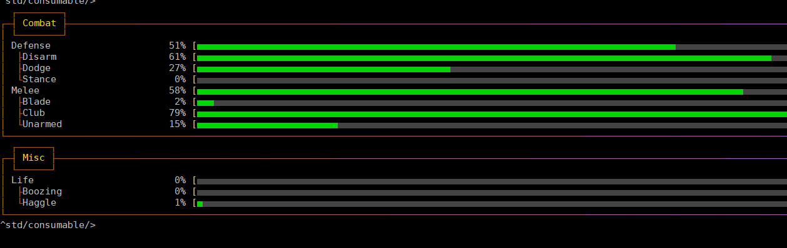
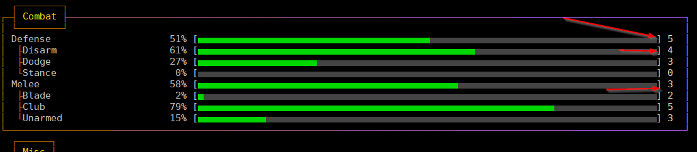

====================
Skill system in LIMA
====================

This is a guide to the skill system in LIMA. Skills are quite flexible and can be adapted
to fit pretty much any purpose you have for your MUD.

A few facts:
   - Skills are part of a skill tree.
   - Skills train when they are used.
   - Both skill leaves and skill branches can be trained.
   - The value of a skill is equal to the value of the tree from the root to the branch.
   - Training skills can give separate training points.

Skills are part of a skill tree
-------------------------------
Skills in LIMA are positioned in a skill tree, and got names like "combat/defense/disarm".

   Skill tree example.

The skills go from zero to a maximum value defined by:

.. code-block:: c

   // Each skill will start at 0, and go to this number of points.
   // Default: 10000
   // Range: 5000-30000
   // Type: integer
   #define MAX_SKILL_VALUE 10000

It is fine to increase or decrease these ranges if you want the players to spend a longer time before maxed
out. This goes for all the values described in this guide, play around and see what speed of progression
you would like.

.. note::
   
   The comments above the ``#define`` are for easy maintenance via the `admtool <../command/admtool.html>`_.
   The range here is a recommendation more than a hard limit. If you break the ranges, funny things might
   start happening.

Skills train when they are used
-------------------------------
When the player uses a skill, it is trained. It will gain more if the skill check succeeds, and a little less
when it fails. Training will also be slower as you gain more point. This means players will have to keep
searching for new challenges, they can keep up the grind, but it will earn them less and less.

The main defines to fiddle with to set the speed of learning are:

.. code-block:: c

   // The max amount of points that can be gained for learning.
   // Default: 10
   // Range: 10-50
   // Type: integer
   #define TRAINING_FACTOR 10

   // As a person's skill increases, the amount they learn decreases. A higher value here will mean quicker ranks at first.
   // Default: 10
   // Range: 3-20
   // Type: integer
   #define LEARNING_FACTOR 10

When training a skill down the tree, there is a chance that some point will flow up the tree towards the root. 
So if you train a specific laser pistol, e.g., some of your training is valid for pistols in general.
Your skill value in a specific skill is the total of that branch, so the new pistol would have 0 in the 
specific skill, but would not be in total since you have experience with other pistols.

So, example:
   |  combat 10
   |  combat/pistol 10
   |  combat/pistol/laser gun 100
   |  combat/pistol/revolver 10

The total skill is an aggregate of the the skill, so (a simple, not completely correct, example) 
"combat/pistol/laser gun" would be 10+10+100, where as "combat/pistol/revolver" would be 10+10+10.

.. code-block:: c

   // The skill points learned move up the tree, divided by this number.
   // Default: 2
   // Range: 2-10
   // Type: integer
   #define PROPAGATION_FACTOR 2

Theoretically, you could set the PROPAGATION_FACTOR to 0, if you didn't want any propagation at all.

The reason the example is not completely correct, is that the aggregated value is a factor of the
parents as defined as:

.. code-block:: c

   // A skill value is an aggregate of all the parents. 1/N^i of parent skills aggregate into the specified skill
   // Default: 3
   // Range: 2-5
   // Type: integer
   #define AGGREGATION_FACTOR 3

This define minimum you learn on failure and minimum  and maximum on win:

.. code-block:: c

   // Points learned by N on failure
   // Default: 1
   // Range: 1-5
   // Type: integer
   #define SKILL_ON_FAILURE 1

   // Minimum to learn on a win
   // Default: 2
   // Range: 2-5
   // Type: integer
   #define SKILL_MIN_ON_WIN 2

   // Maximum points to learn on a win
   // Default: 20
   // Range: 10-30
   // Type: integer
   #define SKILL_MAX_ON_WIN 20

Training points
---------------

There is a chance to gain training points, that might be used at skill trainer to gain more points, faster,
in a specific skill. This entices the player to find trainers - perhaps they wander your MUD? ("Hey George! That
skill trainer you have been searching for all week is standing right here!").

   Skill tree example.

This define sets whether or not you use training points. They are supported in the ``M_TRAINER`` module directly.

.. code-block:: c

   // Do we use training points or not
   // Default: yes
   // Type: boolean
   #define SKILL_CONFIG_USES_TRAINING_PTS

Skill ranks
-----------
Getting from 0 to, say 10000, is a long journey, so to give a better sense of accomplishment, the skill range
is divided into a set of skill ranks. There are 20 ranks for the entire range (defined in SKILL_D). These
can be presented as a normal number or a *fancy* roman numeral.

.. code-block:: c

   // Use roman numerals for skill ranks - no means plain numbers.
   // Default: yes
   // Type: boolean
   #define USE_ROMAN_NUMERALS

.. warning::

   Changing some of these values might anger players who spend months on grinding up some skill,
   if you suddenly reduce the time it needs to be maxed out to half the time. Consider what you
   are doing when changing these values, and communicate clearly to your player base. Test your
   changes before using them in a live environment. Did you just read the word "test"? There
   it was again.

Update the skill tree
---------------------
The default skill tree that comes with LIMA can be dumped to ``/data/config/`` by doing the command:

   |  /data/config/> @SKILL_D->dump_skills_to_file()
   |  Skills dumped to /data/config/skill-tree.
   |  0
   |  /data/config/>more skill-tree

Feel free to edit this file, read the comments at the top, save it and load a new set of skills:

   |  /data/config/>@SKILL_D->init_skills()
   |  /data/config/skill-tree loaded.

You can also make the skill tree more shallow or deeper this way. If you want to make minor changes,
use the ``SKILL_D->register_skill("my/new/skill");`` or ``SKILL_D->remove_skill("my/old/skill")``.
Both can be called directly from the wizard shell like the ``dump_skills_to_file()`` and ``init_skills``
functions above.

See `SKILL_D documentation <../daemon/daemons-skill_d.html>`_ for more details on functions 
in the SKILL_D.

.. tip::

   This will break all the functionality and demo examples referring to the old skills. So if you
   just want to rename a skill, search for that skill name through the mudlib, and make sure to
   replace the skill name everywhere.

Other things worth knowing
--------------------------
The `skills command <../player_command/skills.html>`_ can show the skills of a player, or as a wizards 
it can show skills for monsters and players in the room you're standing in. 
This can be used for resolving issues with both types of objects.

To understand the interface for player skills, you should read `mudlib: body skills <../mudlib/body-skills.html>`_, 
and for monsters (that have a simpler implementation) you should read the 
`adversary skills documentation <../mudlib/adversary-skills.html>`_.

Here is an excerpt from a a skill trainer (the entire code can be found in ``^std/trainer.c``):

.. code-block:: c 

   void setup()
   {
      int skill = 1000;

      set_name("Tara");
      set_gender(1);
      set_id("tara", "human", "trainer");
      set_proper_name("Tara");
      set_in_room_desc("Tara, a confident looking female fighter");
      set_long("Tara is quite buff and seems to have great skills with a range of weapons.");

      // Set skills we train. These will be automatically shown during 'talk to ...'.
      set_trainer_skill("combat/defense/disarm", skill);
      set_trainer_skill("combat/defense/dodge", skill);
      set_trainer_skill("combat/melee", skill);
      set_trainer_skill("combat/melee/blade", skill);
      set_trainer_skill("combat/melee/club", skill);
      set_trainer_skill("combat/melee/improv", skill);
      set_trainer_skill("combat/melee/unarmed", skill);

      // Stats we train
      set_train_stat(({"strength", "agility"}));

      set_options((["hello":"Hi! Can you tell how skills work?",
                "potential":"What do you mean potential?", "trainpts":"How do I see how many training points I have?",
                 "whatrank":"What are skill ranks?", "skillrank":"Why does YOUR skill rank matter to me?",
                 "trainers":"How do I find trainers?"]));

      set_responses((
          ["hello":"Hello there! Everything you do on " + mud_name() +
                       " trains your skills. Do a thing more and you gain more skills "
                       "doing that. But I'm willing to train you further - if you have the potential?@@potential,whatrank",
              "potential":"You need to gather training points as part of practicing your 'skills'. If you have these, I "
                          "can train you.@@trainpts",
               "trainpts":"You use the \"skills\" command. The numbers at the end are your "
                          "training points for a certain skill. ",
               "whatrank":what_rank(),
              "skillrank":"I cannot train you above my own skill rank, so finding new trainer will become important to "
                          "you.@@trainers",
               "trainers":"You need to find trainers in the world that can train you in other skills than I, but also at "
                          "a higher rank. Best of luck!",
      ]));

      set_start(({"hello"}));
      setup_trainer_conversation(skill);
   }

